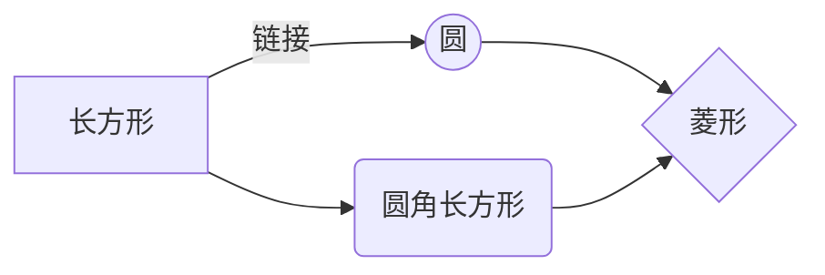
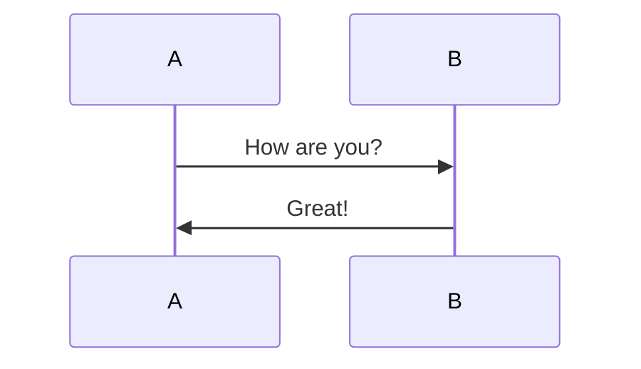
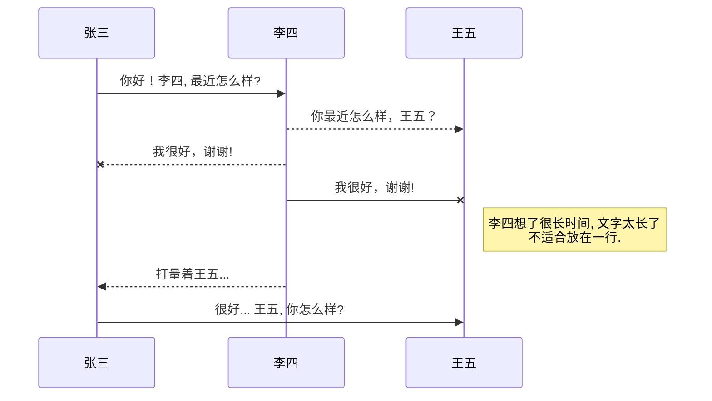
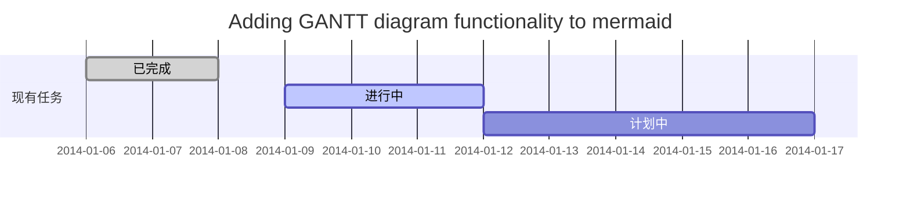
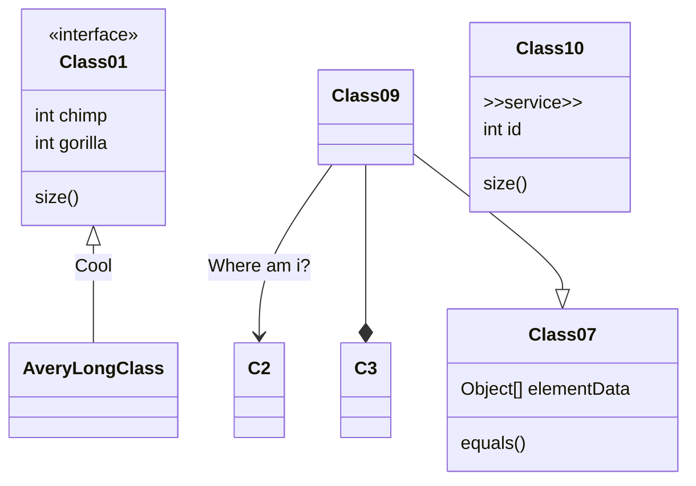

教程和实例在我的有道云笔记

其它菜鸟教程  https://www.runoob.com/markdown/md-tutorial.html

实例已放入码云：https://gitee.com/lishuoboy/lishuoboy-markdown

# 1.目录(IDEA、有道不支持)

@[toc]

# 2.标题

# 一级标题

## 二级标题

### 三级标题

#### 四级标题

##### 五级标题

###### 六级标题

# 3. 文本样式

> 引用

**加粗**

*斜体*

~~删除线~~

<u>下划线2</u>

++下划线（IDEA、Typora、CSDN不支持）++

==标记黄底（IDEA、Typora不支持）==

下标 H~2~O（IDEA、Typora不支持）

上标 2^10^（IDEA、Typora不支持）

# 4.列表

## 有序列表

1. 一级
    1. 二级
        1. 三级
2. 一级

## 无序列表

- 一级
    - 二级
        - 三级
- 一级
    + 二级
        + 三级

## 任务列表

- [x] 完成任务列表
- [x] 完成任务列表
- [ ] 未完成任务列表
- [ ] 未完成任务列表

## 自定义列表（IDEA、Typora不支持）

Markdown
:  Text-to-HTML conversion tool

Authors
:  John
:  Luke

# 5.超链接

[超链接](https://www.baidu.com)

# 6.图片

图片:


下面带格式的图片（IDEA、Typora、有道不支持） 带尺寸的图片:


宽度确定高度等比例的图片:


高度确定宽度等比例的图片:


居中的图片:


居中并且带尺寸的图片:


居右的图片:


# 7.水平线

---

# 8.表格

| 序号  | 姓名  |
|-----|-----|
| 1   | 张三  |
| 2   | 李四  |

# 9. HTML

<html lang="zh">
<!-- 在这里插入内容 -->
<b>html内容</b>
</html>

# 10.各种代码片

## 10.1. java/javascript

```java
/** 注释 */
public class User {
    private String name;  // 姓名
}
```

```javascript
/** 注释 */
function getName() {
    return "张三";  // 姓名
}
```

## 10.2. JSON/XML

```json
{
  "id": 1,
  "name": "张三"
}
```

```xml

<root>
    <id>1</id>
    <name>张三</name>
</root>
```

## 10.3 公式（IDEA、有道云不支持）

$$ E = mc^2 $$

Gamma公式展示 $\Gamma(n) = (n-1)!\quad\forall n\in\mathbb N$ 是通过 Euler integral

$$ \Gamma(z) = \int_0^\infty t^{z-1}e^{-t}dt\,. $$

## 10.3 math（IDEA、Typora、CSDN不支持）

```math
E = mc^2
```

```math
\Gamma(z) = \int_0^\infty t^{z-1}e^{-t}dt\,. 
```

## 10.4 graph 流程图（都支持，但是有道不能有mermaid）




## 10.5 mermaid 流程图（IDEA、Typora、有道不支持）

```mermaid
flowchat
st=>start: 开始
e=>end: 结束
op=>operation: 我的操作
cond=>condition: 确认？

st->op->cond
cond(yes)->e
cond(no)->op
```

## 10.6 UML时序图（IDEA不支持，有道支持但是不能有mermaid）





## 10.6 甘特图（IDEA不支持，有道支持但是不能有mermaid）




## 10.7 类图（IDEA、Typora、有道不支持）



# 11. 脚注

引用URL。[^1]

引用本地文件。[^2]

[^1]: http://www.baidu.com

[^2]: .gitignore
